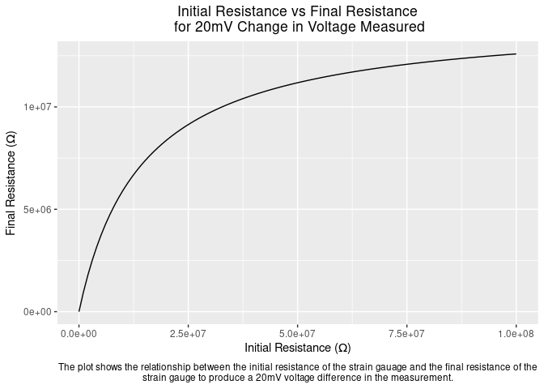
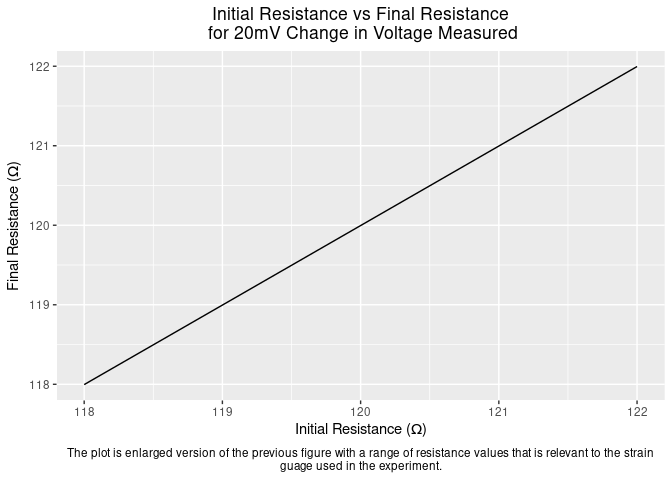

Lab 3: Strain Gauge Scale
================
Daeyoung Kim
2/17/2023

- <a href="#calibration-plot" id="toc-calibration-plot">Calibration
  Plot</a>
- <a href="#calculating-the-percent-error"
  id="toc-calculating-the-percent-error">Calculating the Percent Error</a>
- <a href="#associated-change-in-electrical-resistance"
  id="toc-associated-change-in-electrical-resistance">Associated Change in
  Electrical Resistance</a>
- <a href="#calculating-the-required-change-in-mass"
  id="toc-calculating-the-required-change-in-mass">Calculating the
  Required Change in Mass</a>

## Calibration Plot

``` r
df_strain_gauge %>% 
  ggplot(aes(x = Mass, y = Voltage)) + 
  geom_point(aes(color = "Calibration Measurements")) +
  stat_poly_line(
    formula = (predict_voltage.formula <- y ~ x),
    se = FALSE, 
    linewidth = 0.5
    ) +
  stat_poly_eq(
    formula = predict_voltage.formula,
    use_label("eq"), 
    coef.digits = 4, 
    size = 5,
    label.x = "right",
    label.y = "bottom"
    ) +
  labs(
    x = 'Mass (g)',
    y = 'Voltage (mV)',
    title = "Voltage vs Mass", 
    caption = str_wrap("The plot shows the relationship between the measured voltage and the amount of mass that hung on the strain gauge. The theoretical points were calculated based on the slope of the calibration measurements. The actual points show the actual voltage measurements with the respective amount of mass.", 80)
  ) + 
 theme(
    plot.title = element_text(hjust = 0.5),
    plot.caption = element_text(hjust = 0.5),
    legend.title = element_blank()
    ) +
  coord_cartesian(xlim =c(0, 300), ylim = c(0, 500)) +
  geom_point(
    data = df_prediction,
    mapping = aes(x = Mass, y = Voltage, color = 'Actual')
  ) +
  geom_point(
    data = df_prediction,
    mapping = aes(x = Mass, y = Theoretical_Voltage, color = 'Theoretical')
  ) + 
  scale_color_manual(
    values = c(
      'Actual' = "red",
      'Theoretical' = "green",
      "Calibration Measurements" = "black"
        )
    )
```

<!-- -->

## Calculating the Percent Error

Using the difference between the actual and the theoretical voltage
measurements, the percent errors were calculated, then averaged.

``` r
df_prediction %>% 
  mutate(Difference = Voltage - Theoretical_Voltage) %>% 
  mutate(Percent_Error = Difference / Voltage) %>% 
  summarize(mean(Percent_Error)) -> mean_percent_error
```

The average percent error of the scale was 6.76%.

## Associated Change in Electrical Resistance

To find the relationship between the measured voltage and the resistance
of the strain gauge, voltage divider rule is applied to each leg of the
Wheatstone Bridge of the circuit.

Applying the given formula for the measured voltage using the amplifier,

Since the voltage from the fixed resistance leg of the Wheatstone Bridge
remain constant at 2.5V,

Now, using the given formula for the value of `G`,

For a 20mV change in the voltage measured from the OScope,

The relationship between the initial and the final resistance of the
strain gauge for a 20mV change is hyperbolic at a large range.

``` r
df_resistance <- 
  tibble(R_s_1 = seq(from = 1, to = 10**8, length.out = 100)) %>% 
  mutate(R_s_2 = (115*(125249*R_s_1 - 115))/(R_s_1 + 14403865)) 

df_resistance%>% 
  ggplot() +
  geom_line(mapping = aes(R_s_1, R_s_2)) +
  labs(title = "Initial Resistance vs Final Resistance\n for 20mV Change in Voltage Measured",
       caption = str_wrap("The plot shows the relationship between the initial resistance of the strain gauage and the final resistance of the strain gauge to produce a 20mV voltage difference in the measurement.", 120),
       y = TeX("Final Resistance ($\\Omega$)"), 
       x = TeX("Initial Resistance ($\\Omega$)")
  ) +
  theme(
    plot.title = element_text(hjust = 0.5),
    plot.caption = element_text(hjust = 0.5)
    )
```

<!-- -->

However, for the scope of our experiment and the strain guage used,
which was rated to be between 118$\Omega$ and 122$\Omega$, the
relationship is almost linear and the difference is very minute.

``` r
df_resistance_relevant <- 
  tibble(R_s_1 = seq(from = 118, to = 122, length.out = 100)) %>% 
  mutate(R_s_2 = (115*(125249*R_s_1 - 115))/(R_s_1 + 14403865)) 

df_resistance_relevant %>% 
  ggplot(aes(R_s_1, R_s_2)) +
  geom_line() +
  labs(
    title = "Initial Resistance vs Final Resistance\n for 20mV Change in Voltage Measured",
    caption = str_wrap("The plot is enlarged version of the previous figure with a range of resistance values that is relevant to the strain guage used in the experiment.",
                       120),
    y = TeX("Final Resistance ($\\Omega$)"),
    x = TeX("Initial Resistance ($\\Omega$)"),
  ) +
  theme(
    plot.title = element_text(hjust = 0.5),
    plot.caption = element_text(hjust = 0.5)
    )
```

<!-- -->

``` r
resistance <- function(x, y){
  return((115*(125249*x - 115))/(x + 14403865))
}
R_122 <- (122 - resistance(122))
R_120 <- (120 - resistance(120))
R_118 <- (118 - resistance(118))
```

The associated change in electrical resistance of the strain gauge for
20mV change in measured voltage is then 3.9$m\Omega$, 3.83$m\Omega$,
3.77$m\Omega$ for initial resistance of 122$\Omega$, 120$\Omega$, and
118$\Omega$, respectively.

## Calculating the Required Change in Mass

To calculate the change in mass required to get a 20 mV change in
voltage measured, the slope of the calibration plot (Voltage vs Mass)
was used: So, using the inverse of calculated sensitivity of
$1.446\frac{mV}{g}$, which was $0.6916\frac{g}{mV}$,

``` r
dmdV <- (1/1.446)
mass_required <- dmdV*20
```

The required change in mass is 13.83g for 20mV change in measured
voltage.
