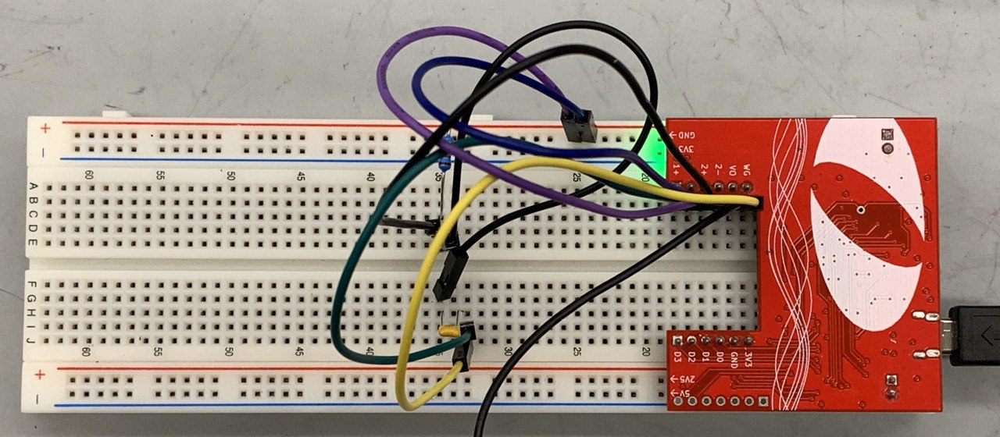
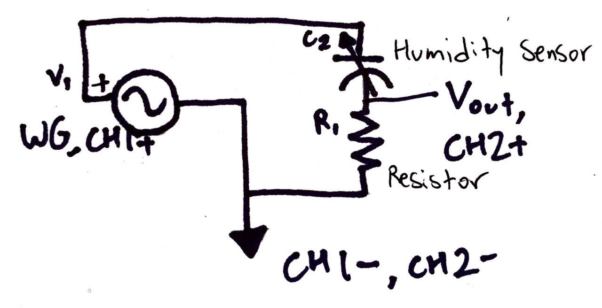
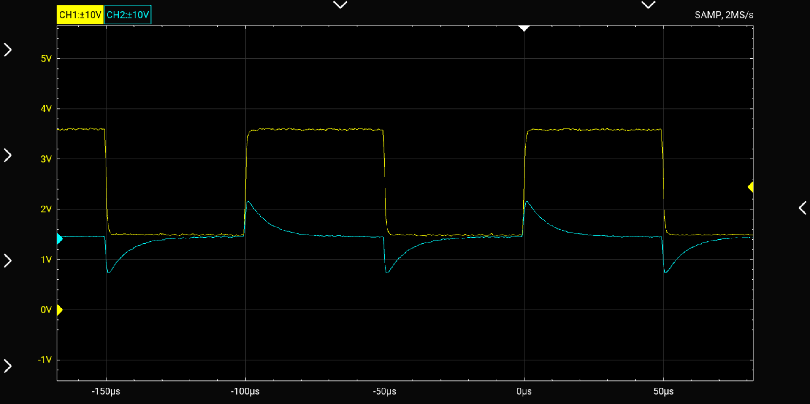

Lab 4: Humidity Sensor
================
Daeyoung Kim
2/24/2023

## Initial Setup

``` r
FREQUENCY <- 10000 # Hz (cycles/s)
PERIOD <- 1/FREQUENCY # (s/cycle)
MAX_CAPACITANCE <- 193e-12 # (F)
OPTIMAL_RESISTANCE <- PERIOD / (10 * MAX_CAPACITANCE)
```

According to the spec sheet of the humidity sensor, the optimal
frequency and the maximum capacitance (which is at 100% relative
humidity) are 10kHz and 193pF, respectively. To find the right
resistance value for the CR circuit used in the experiment, the
frequency was first converted to period. Now, knowing that the spikes
from the capacitor needs to decay within half the square wave period and
that it takes about 5 times the CR time constant to fully decay, the
following relationship was employed, where $T$ is the period of the
square wave and $C$ is the max capacitance of the humidity sensor. With
the equation above and the given condition, the resulting resistance
value was about $51.8k\Omega$. Therefore, the resistor closest to the
desired rating, which was a $49.9k\Omega$ resistor, was used.

## Circuit Diagram and Photo

<div class="figure">


<p class="caption">
Photo of the circuit
</p>

</div>

<div class="figure">


<p class="caption">
Circuit Diagram
</p>

</div>

## Circuit Output in OScope

<div class="figure">


<p class="caption">
Voltage measurement on the OScope
</p>

</div>

The figure above shows the voltage input from the wave generator and the
voltage output in the CR circuit. As intended, half a period of the
square wave is equal to about $5RC$ to let the capacitor charge and
discharge fully.

## Calibration Plot C vs V_RMS

``` r
df_calibration %>% 
  ggplot(aes(x = Capacitance, y = V_rms)) + 
  geom_point(aes(color = "Calibration Measurements")) +
  stat_poly_line(
    formula = (predict_voltage.formula <- y ~ x),
    se = FALSE, 
    linewidth = 0.5
    ) +
  stat_poly_eq(
    formula = predict_voltage.formula,
    use_label("eq"), 
    coef.digits = 4, 
    size = 5,
    label.x = "right",
    label.y = "bottom"
    ) +
  labs(
    x = 'Capacitance (pF)',
    y = 'Voltage (mV)',
    title = "Root-Mean-Square Voltage vs Capacitance", 
    caption = str_wrap("The plot shows the relationship between the root-mean-square voltage and capacitance. 5 capacitance values were chosen between 100pF and 220pF to comprehensively cover the standard operating conditions for the humidity sensor in the process of calibration measurements.", 80)
  ) + 
 theme(
    plot.title = element_text(hjust = 0.5),
    plot.caption = element_text(hjust = 0.5),
    legend.title = element_blank()
    ) +
  scale_color_manual(
    values = c(
      "Calibration Measurements" = "black"
        )
    )
```

<!-- -->

## Plot of C vs RH

``` r
func_RH <- function(x) {
  x = x / 180;
  RH <- -(3.4656e3) * x**3 + (1.0732e4) * x**2 - (1.0457e4) * x + (3.2459e3)
return(RH)
}

df_RH <-
  tibble(capacitance = seq(from = 161.6, to = 193.1, length.out = 100)) %>% 
  mutate(RH = func_RH(capacitance))

breaks = c(seq(165, 200, by=5), 161.6, 193.1)
labels = as.character(breaks)

df_RH %>% 
  ggplot(aes(x = capacitance, y = RH)) +
  geom_line() +
  labs(
    x = 'Capacitance (pF)',
    y = 'Relative Humidity (%)',
    title = "Relative Humidity vs Capacitance", 
    caption = str_wrap("The plot shows the relationship between the capacitance and the relative humidity using the function given by the sensor manufacturer. Range of the capacitance was taken from the specifications of the humidity sensor.", 120)
  ) + 
 theme(
    plot.title = element_text(hjust = 0.5),
    plot.caption = element_text(hjust = 0.5),
    legend.title = element_blank()
  ) +
  geom_vline(
    # data = df_RH %>% filter(RH == max(RH) | RH == min(RH)),
    xintercept =  c(161.6, 193.1),
    linetype = "dashed",
    color = 'blue'
  ) +
  geom_text(
    data = df_RH %>% filter(RH == max(RH) | RH == min(RH)), 
    aes(y = 50, label = paste(capacitance, "pF")), 
    size = 3, 
    angle = 90, 
    nudge_x = 0.5
  )
```

<!-- -->

## Plot of RH vs V

``` r
func_VtoC <- function(voltage) {
  capacitance <- (voltage - 201.5) / 1.977
  return(capacitance)
}

df_RHV <- 
  tibble(voltage = seq(from = 500, to = 600, length.out = 100)) %>% 
  mutate(RH = func_RH(func_VtoC(voltage)))

df_RHV %>% 
  filter(RH > 0 & RH < 100) %>% 
  ggplot(aes(x = voltage, y = RH)) +
  geom_line() +
  labs(
    x = 'Root-Mean-Square Voltage (mV)',
    y = 'Relative Humidity (%)',
    title = "Relative Humidity vs Root-Mean-Square Voltage", 
    caption = str_wrap("The plot shows the relationship between the root-mean-square voltage and the relative humidity using the function given by the sensor manufacturer and the line of best fit given by the calibration plot of capacitance vs voltage. Range of the voltage was chosen to limit the relative humidity from 0 to 100%.", 120)
  ) + 
 theme(
    plot.title = element_text(hjust = 0.5),
    plot.caption = element_text(hjust = 0.5),
    legend.title = element_blank()
  )
```

<!-- -->

## Humidity in the Lab

``` r
ROOM_RH_V <- 540
ROOM_RH <- func_RH(func_VtoC(540))
paste("Relative Humidity in the Lab:", round(ROOM_RH, digits = 1), "%")
```

    ## [1] "Relative Humidity in the Lab: 26.7 %"

The relative humidity of the lab was calculated to be around 26.7%.
Considering that a comfortable indoor RH is between 30-50% and the
buildings have been dry due to the heating, the value seems reasonable.
Additionally, the RH value in the lab from a digital sensor device
showed about 20% on Feb 24, 2023 with dry weather outside. The
calculated value from the experiment was higher than this value but the
snowfall/sleet from the day of the experiment might have increased the
RH a little bit. If the experiment was conducted over multiple days with
a variety of weather conditions, the results of the humidity sensor
could be further validated.
