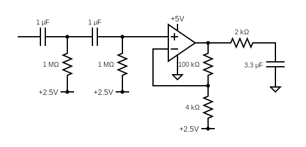

```{r Setup, message=FALSE}
library(tidyverse)
library(googlesheets4)
```
### Introduction

#### Circuit Design

```{r Circuit Schematic, echo=FALSE}

```

The voltage output from the blood pressure sensor goes through a circuit that has a second-order high pass filter with a cutoff frequency at about 0.16 Hz, then an op amp with a gain of 26, and finally a low pass filter with a cutoff frequency at about 24.11 Hz. 

##### 2.5 V as Reference Voltage
The 2.5 V as the reference for the high pass filters and the op amp allows the op amp to be able to return a meaningful voltage value for all range of the input voltage. The voltage input to the op amp from the high-pass filters will now be all positive values since it will now be centered about 2.5 V, instead of being centered about 0 V. If the reference voltage was at 0 V, the op amp wouldn't have been able to return meaningful values for input voltages that were below 0 V. 


```{r Circuit Setup - Cutoff Frequency}
# CR filters:
# Capacitor: 1 microF
# Resistor: 1 Mohm
# 
# RC filter:
# Resistor: 2kohm
# Capacitor: 3.3microF

CR <- 1e-6*1e6
RC <- 2e3*3.3e-6

F_CR <- 1/(2*pi*CR)
F_RC <- 1/(2*pi*RC)

df_cutoff_f <- 
  tibble(
  F_CR,
  F_RC
  ) %>% 
  pivot_longer(
    names_to = c(".value", "filter_type"),
    names_sep = ("_"),
    cols = everything()
  ) %>% 
  rename(
    'cutoff_frequency' = F
  )

df_cutoff_f
```


```{r Circuit Setup - Gain}
gain <- 1 + 100e3/4e3
paste("The gain of the op amp is", gain)
```

### Results
#### Load Data
```{r Load Blood Pressure and Bode Plot data, include=FALSE}
url <- "https://docs.google.com/spreadsheets/d/10CJvjHC7Hn-eskJru7n4J9QzwCS8cR9vsAvtEf13TuY/edit#gid=915218639"
gs4_auth(email=TRUE)

df_bp_raw <- read_sheet(url, sheet = "BP")
df_bode_raw <- read_sheet(url, sheet = "bode")
```
```{r}
df_bp_raw
```

#### Process Data
```{r Process data}
df_bp <- 
df_bp_raw %>% 
  select(-t2) %>% 
  rename(
    time = t1,
    v_in = ch1,
    v_out = ch2
  ) %>% 
  filter(time <= 0) %>% 
  mutate(time = time - time[1])
```
#### Plot Data
```{r Plot data}
df_bp %>% 
  ggplot() +
  geom_line(aes(time, v_in, color = "Voltage input")) +
  geom_line(aes(time, v_out, color = "Voltage output")) +
  labs(
    title = "Voltage vs Time for Input and Output",
    y = "Voltage (V)",
    x = "Time (s)",
    caption = str_wrap("The plot show the input voltage from the blood pressure sensor and the voltage output after filtering and amplifying.", 100)
  ) +
  theme(
    plot.caption= element_text(hjust = 0, size = 10),
    legend.title = element_blank()
  )
```

#### Add Transfer Function
```{r Add transfer function}
v_to_p <- function (voltage) {
  ((voltage / 5) - 0.04) / 0.018
}

df_bp_pressure <- 
  df_bp %>% 
  mutate(
    pressure = map_dbl(v_in, v_to_p)
  )
  
df_bp_pressure %>% 
  ggplot(aes(time, pressure)) +
  geom_line() +
  labs(
    x = "Time (s)",
    y = "Pressure (kPa)",
    title = "Blood Pressure vs Time",
    caption = str_wrap("The plot shows the pressure values converted from voltage using the transfer function.", 100)
  )+
  theme(
    plot.caption= element_text(hjust = 0, size = 10)
  )
```

#### Final Plot
```{r Convert from kPa to mmHg}
convert_pressure <- function (pressure) {
  pressure * 7.50062
}

df_bp_converted <- 
  df_bp_pressure %>% 
  mutate(
    pressure = map_dbl(pressure, convert_pressure)
  )

coeff <- 0.01
df_bp_converted %>% 
  ggplot() +
  geom_line(aes(time, v_out, color = "Voltage Output")) +
  geom_line(aes(time, pressure*coeff, color = "Pressure")) +
  scale_y_continuous(
    # Features of the first axis
    name = "Voltage Output (V)",
    
    # Add a second axis and specify its features
    sec.axis = sec_axis(~./coeff, name="Pressure (mmHg)")
  ) +
  
  geom_vline(
    data = . %>% filter(time > 10 & time < 11) %>% filter(v_out == max(v_out)),
    aes(xintercept = time),
    linetype = 4
  ) +
  geom_label(
    data = . %>% filter(time > 10 & time < 11) %>% filter(v_out == max(v_out)),
    aes(time + 7, pressure*coeff + 0.3, label = paste("Mean pressure:\n", round(pressure, 2), "mmHg")),
    size = 3
  ) +
  geom_point(
    data = . %>% filter(time > 10 & time < 11) %>% filter(v_out == max(v_out)),
    aes(time, pressure*coeff, color = "Mean Pressure"), 
    size = 5, 
    alpha = 0.5
  ) +
  labs(
    x = "Time (s)",
    title = "Voltage Output and Blood Pressure vs Time",
    caption = str_wrap("The plot shows the voltage output on the left y-axis and the blood pressure on the right y-axis. The vertical line on the plot marks the peak in the voltage output cycle of greatest amplitude, which signifies the point of mean blood pressure.", 110)
  ) +
  theme_minimal() +
  theme(
    plot.caption= element_text(hjust = 0, size = 10),
    legend.title = element_blank()
  )
```

#### Bode Plot
```{r Bode Plot}
df_bode <- 
df_bode_raw %>% 
  mutate(
    gain = v_out/v_in
  )

df_bode %>% 
  ggplot(aes(f, gain)) +
  geom_point() +
  geom_line() +
  geom_vline(
    data = df_cutoff_f,
    aes(xintercept = cutoff_frequency, color = "Cutoff Frequency"),
    linetype = 4
  ) +
  geom_label(
    data = df_cutoff_f,
    aes(x = cutoff_frequency, y = 4.5, label = paste(round(cutoff_frequency, 2), "Hz")),
    size = 3
  ) +
  labs(
    x = 'Frequency (Hz)',
    y = 'Gain',
    title = 'Bode Plot of the Circuit',
    caption = str_wrap('The cutoff frequencies of the two high-pass filters and a single low-pass filter are about 0.16 Hz and 24 Hz, respectively. The gain on the left side of the plot around the cutoff frequency of the high pass filters is steeper than the right side of the plot about the cutoff frequency of the low pass filter since the circuit has a second-order high pass filter and a first-order low pass filter.', 110)
  ) +
  scale_x_log10() +
  scale_y_log10() + 
  theme_minimal() +
  theme(
    legend.title = element_blank(),
    plot.title = element_text(hjust = 0.5),
    aspect.ratio = 0.6,
    plot.caption = element_text(hjust = 0, size = 10)
  )
```
