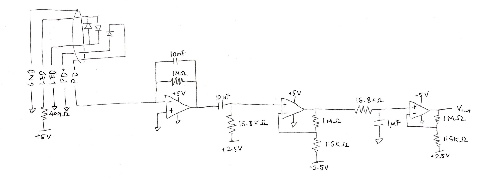
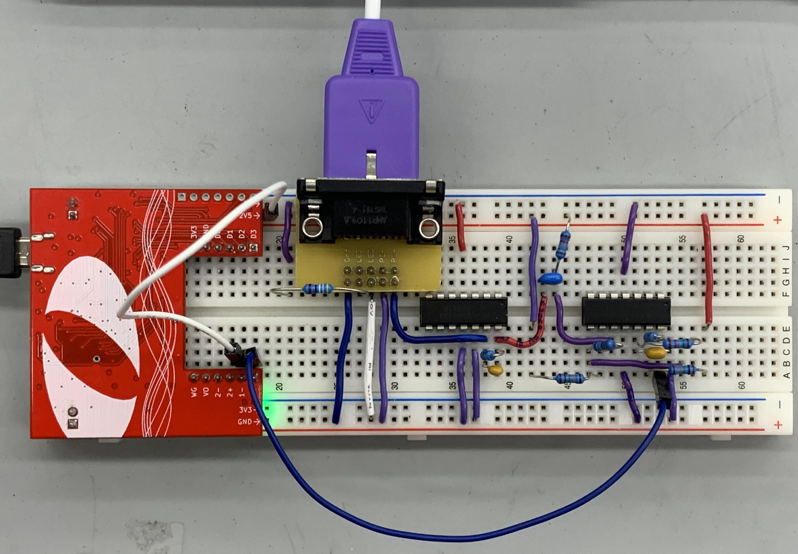

```{r Setup, message=FALSE}
library(tidyverse)
```

### Introduction

#### Circuit Design

```{r Circuit Schematic, echo=FALSE}

```

```{r Circuit, echo=FALSE}

```

#### Filters and Gain

To process the input voltage signal from the photo diode, a low pass filter with 1 MΩ resistor and 10 nF capacitor is used with a cutoff frequency of about 16 Hz. Then, a high pass filter with 10 µF capacitor and 15.8 kΩ resistor were used to filter out frequencies that are much slower than human pulse. The cutoff frequency was about 0.16 Hz. For the connecting op amp, 1 MΩ and 115 kΩ resistors were used to create a gain of about 9.7. To again filter higher frequency noise, an RC filter with 15.8 kΩ resistor and 1 µF capacitor were used with a cutoff frequency of 24 Hz. Again, an op amp with 1 MΩ and 115 kΩ resistors were used to create a gain of about 9.7. 

```{r Circuit Setup - Cutoff Frequency}
# First RC filter:
# Resistor: 1 MΩ
# Capacitor: 10 nF
#
# CR filter:
# Capacitor: 10 µF
# Resistor: 15.8 kΩ
# 
# Second RC filter:
# Resistor: 15.8 kΩ
# Capacitor: 1 µF
# 
# Op Amp:
# R1: 1 MΩ
# R2: 115 kΩ

RC1 <- 1e6*10e-9
CR <- 1e-6*1e6
RC2 <- 2e3*3.3e-6


df_cutoff <- 
  tibble(
    "filter_type" = c("low pass", "high pass", "low pass"),
    "RC_value" = c(RC1, CR, RC2)
  ) %>% 
  mutate(
    cutoff_frequency = 1/(2*pi*RC_value)
  )
  
df_cutoff
```

#### Bode Plot

```{r Bode Plot}
df_bode <- read_csv('data/bode.csv', show_col_types = FALSE)

df_bode %>% 
  ggplot(aes(freq, gain)) +
  geom_line() +
  scale_x_log10() +
  labs(
    title = "Bode Plot",
    x = "Frequency (Hz)",
    y = "Gain (dB)"
  ) +
  theme_minimal()
```

### Results

To test the pulse detector, two cases were tested:

1. Resting state
2. Immediately after running up 4 flights of stairs. 

```{r Results}
df_rest_raw <- read_csv("data/rest.csv", show_col_types = FALSE)
df_run_raw <- read_csv("data/run.csv", show_col_types = FALSE)

df_rest <- 
  df_rest_raw %>% 
  select(t1, ch1) %>% 
  mutate(
    t1 = t1 - t1[1],
    state = "Rest"
    ) %>% 
  rename(
    time = t1,
    voltage = ch1
  )

df_run <- 
  df_run_raw %>% 
  select(t1, ch1) %>% 
  mutate(
    t1 = t1 - t1[1],
    state = "Run"
    ) %>% 
  rename(
    time = t1,
    voltage = ch1
  )

df_pulse <- 
  rbind(df_rest, df_run)

df_pulse %>% 
  ggplot(aes(time, voltage, col = state)) +
  geom_line() +
  facet_wrap(~state, ncol =1) +
  labs(
    title = "Voltage vs Time",
    x = "Time (s)",
    y = "Voltage (V)",
    caption = str_wrap("The plot shows the pulse measured at resting state and right after running. The frequency of the pulse in the lower plot is much greater than that of the higher one. The approximate pulse rates are 60 bpm and 150 bpm at resting state and at after running state, respectively.", 100),
    color = "State"
  ) +
  theme(
    plot.caption = element_text(hjust = 0, size = 10)
  )
```

