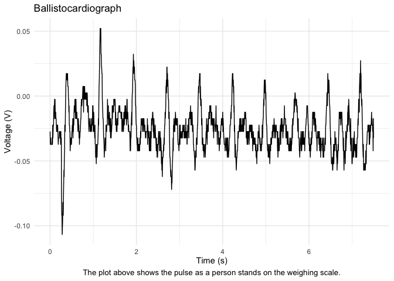

Lab 8: Ballistocardiograph
================
Daeyoung Kim
2023-04-28

- <a href="#introduction" id="toc-introduction">Introduction</a>
- <a href="#circuit" id="toc-circuit">Circuit</a>
- <a href="#bode-plots" id="toc-bode-plots">Bode Plots</a>
- <a href="#bcg-trace" id="toc-bcg-trace">BCG Trace</a>

``` r
library(tidyverse)
```

### Introduction

To measure heartbeat from the slight recoil of the weighing scale with a
person standing on it, I first put an amplifier with a gain of 101, then
two band pass filters in series with a gain of -10 and cutoff
frequencies of 0.5 Hz to 16 Hz. Finally, the voltage signal was filtered
with a second order low pass filter with a cutoff frequency of 16 Hz.

### Circuit

#### Circuit Schematic


#### Circuit on Breadboard


#### Circuit with Weighing Scale


``` r
df_bandpass <- read_csv("data/bode_bandpass.csv")
df_lowpass <- read_csv("data/bode_lowpass.csv")
df_bcg <- read_csv("data/BCG.csv")
```

### Bode Plots

``` r
df_bandpass %>% 
  ggplot(aes(freq, gain)) +
  geom_line() +
  scale_x_log10() +
  labs(
    title = "Bode Plot of Bandpass Filter",
    x = "Frequency (Hz)",
    y = "Gain (dB)",
    caption = "The bode plot shows the gain of a bandpass filter with cutoff frequencies of 0.5 Hz and 16 Hz."
  ) +
  theme_minimal() +
  theme(
    plot.caption = element_text(hjust = 0.5, size = 10)
  )
```

<!-- -->

``` r
df_lowpass %>% 
  ggplot(aes(freq, gain)) +
  geom_line() +
  scale_x_log10() +
  labs(
    title = "Bode Plot of Second Order Lowpass Filter",
    x = "Frequency (Hz)",
    y = "Gain (dB)",
    caption = "The bode plot shows the gain of the second order lowpass filter with a cutoff frequency of 16 Hz."
  ) +
  theme_minimal() +
  theme(
    plot.caption = element_text(hjust = 0.5, size = 10)
  )
```

<!-- -->

### BCG Trace

``` r
df_bcg %>% 
  select(t1, ch1) %>% 
  mutate(
    t1 = t1 - t1[1]
    ) %>% 
  rename(
    time = t1,
    voltage = ch1
  ) %>% 
  ggplot(aes(time, voltage)) +
  geom_line() +
  labs(
    title = "Ballistocardiograph",
    x = "Time (s)",
    y = "Voltage (V)",
    caption = "The plot above shows the pulse as a person stands on the weighing scale."
  ) +
  theme_minimal() +
  theme(
    plot.caption = element_text(hjust = 0.5, size = 10)
  )
```

<!-- -->
