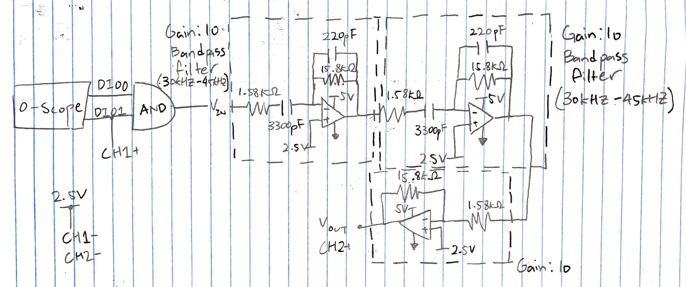
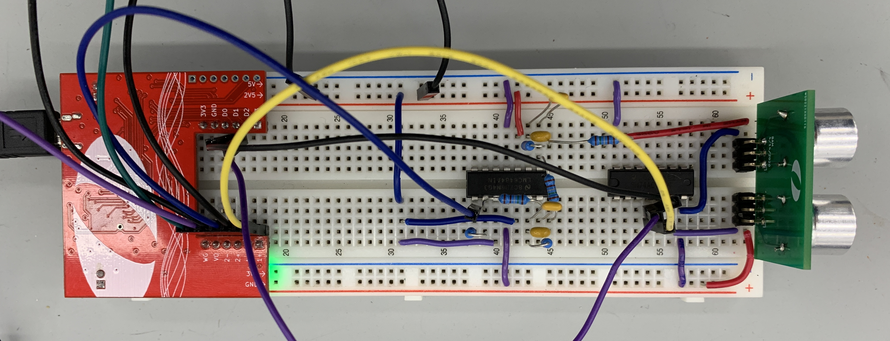

```{r Setup, message=FALSE}
library(tidyverse)
```

### Circuit

#### Circuit Schematic

```{r Circuit-Schematic, echo=FALSE, out.width="50%"}

```

#### Circuit on Breadboard

```{r Circuit, echo=FALSE, out.width="50%"}

```

#### Bode Plot of Receiver Unit
```{r Bode Plot, message=FALSE}
df_bode_receiver <- read_csv("data/receiver_bode.csv")

df_bode_receiver %>% 
  ggplot(aes(freq, gain)) +
  geom_line() +
  geom_vline(xintercept = 45e3, linetype = 4) +
  geom_vline(xintercept = 30e3, linetype = 4) +
  scale_x_log10(breaks = c(1e2, 1e3, 1e4, 30e3, 45e3, 1e5)) +
  expand_limits(y = c(-25, 50)) +
  scale_y_continuous(breaks = c(-25, 0, 25, 50)) +
  labs(
    title = "Bode Plot of the Receiver Circuit",
    x = "Frequency (Hz)",
    y = "Gain (dB)",
    caption = str_wrap("The bode plot shows the gain of second order bandpass filter with cutoff frequencies of 30 kHz and 45 kHz, and the third op amp circuit without any filter.", 100)
  ) +
  theme_minimal() +
  theme(
    plot.caption = element_text(hjust = 0.5, size = 10),
    axis.text.x = element_text(angle = 45, hjust = 1)
  )
```

### Results

#### Echo Plot

```{r Echo-Plot, message=FALSE}
df_echo <- read_csv("data/2ft.csv")

df_echo %>% 
  select(t1, ch1, ch2) %>% 
  mutate(
    t1 = t1 - t1[1] - 0.015
    ) %>% 
  mutate(
    t1 = t1 * 1000
  ) %>% 
  rename(
    time = t1,
    voltage_transmit = ch1,
    voltage_received = ch2
  ) %>% 
  pivot_longer(
    cols = -time,
    names_to = "type",
    names_prefix = "voltage_",
    values_to = "voltage"
  ) %>% 
  ggplot(aes(time, voltage)) +
  geom_line(
    data = . %>% filter(between(time, 0, 7.5)),
    aes(group = type, color = type)
    ) +
  geom_label(
    data = tibble(x = 3, y = 3.6, label = "Actual:\n3.61 ms"),
    aes(x, y, label = label),
    size = 3
  ) +
  geom_vline(
    xintercept = c(1.12, 4.74),
    linetype = 4
  ) +
  geom_vline(
    aes(
      xintercept = 1.12 + 3.466044,
      color = "expected"
    ),
    linetype = 3
  ) +
  geom_segment(
    aes(x = 1.12, y = 4, xend = 4.74, yend = 4),
    arrow = arrow(length = unit(0.02, "npc"), ends = "both"),
    linewidth = 0.3,
    color = "orange"
  ) +
  geom_label(
    data = tibble(x = 4, y = 3.3, label = "Excepted:\n3.47ms"),
    aes(x, y, label = label),
    size = 3
  ) +
  theme_minimal() +
  labs(
    title = "Voltage vs Time for Transmitter and Receiver Unit",
    x = "Time (ms)",
    y = "Voltage (V)",
    caption = str_wrap("The plot shows the transmitter and receiver's voltage signal over time when the range finder is about 4 feet away from the wall. The time for the echo to travel back was about 3.61 ms while the expect time of travel was about 3.47 ms with the known distance from the wall.", 100)
  ) +
  theme(
    plot.caption = element_text(hjust = 0.5, size = 10),
    legend.title = element_blank()
  )
```

#### Rangefinder Distance vs Actual Distance

```{r Results-Distance}

df_results <- 
  tibble(
    distance_actual = c(11.375, 23.375, 35.375, 47.375, 59.375),
    time = c(1.773, 3.614, 5.402, 7.189, 8.925)
  )

df_results %>% 
  mutate(
    distance_actual = distance_actual * 2,
    distance_rangefinder = time * 13.488
    ) %>% 
  ggplot(aes(distance_actual, distance_rangefinder)) + 
  geom_point() + 
  geom_line(aes(color = "Actual")) +
  geom_abline(aes(color = "Ideal", slope = 1, intercept = 0), linetype = 2) +
  labs(
    title = "Range Finder Distance vs Actual Distance",
    x = "Actual Distance (inch)",
    y = "Range Finder Distance (inch)",
    caption = str_wrap("The range finder distances are slightly larger than the actual distances measured with a ruler.", 100)
  ) +
  theme_minimal() +
  theme(
    legend.title = element_blank(),
    plot.caption = element_text(hjust = 0.5, size = 10)
  )
```

```{r Results-Time}
df_results %>% 
  mutate(
    distance_actual = distance_actual * 2,
    distance_rangefinder = time * 13.488
    ) %>% 
  pivot_longer(
    cols = -time,
    names_to = "type",
    names_prefix = "distance_",
    values_to = "distance"
  ) %>% 
  
  ggplot(aes(time, distance)) +
  geom_point(aes(color = type, shape = type), size = 2) + 
  geom_line(aes(color = type), linetype = 2) +
  labs(
    title = "Distance vs Time",
    x = "Time (ms)",
    y = "Distance (inch)",
    caption = str_wrap("The plot above shows the distance measured by the range finder and the actual distance with respect to time.", 80)
  ) +
  theme_minimal() +
  theme(
    legend.title = element_blank(),
    plot.caption = element_text(size = 10, hjust = 0.5)
  ) 
```

#### Performance

The range finder works surprisingly well but with some caveats. The errors were at most about 2.2 inches -- all data points from the range finder were within 1-2 inches from the actual distances. The trend within the distances measured by the range finder seems visually very linear as well, just slightly larger than the actual distance. 

While the data collection was done using a solid wall to bounce off the ultrasonic waves, the device did not perform as well on less reflective surfaces, such as fluffy cotton fabric. Furthermore, there was some human error involved in deciding when the receiver's blip began since the blips did not have a very sharp change. It was especially difficult at shorter distances since the initial blip merged with the wave that actually represented the receiver status. There was a similar phenomenon at distances that were larger than 10 ft where the blips, again, started to merge and interfere with each other, and it became challenging to read which signal represented the receiver. 

It's not possible to definitively conclude on the accuracy of the range finder with merely 5 data points collected. But if I had to, I would generally trust the distances measured from the range finder in the range between 2-10 ft, with an understanding that the range finder tends to give slightly longer distances, and that it may be off by few inches. 

